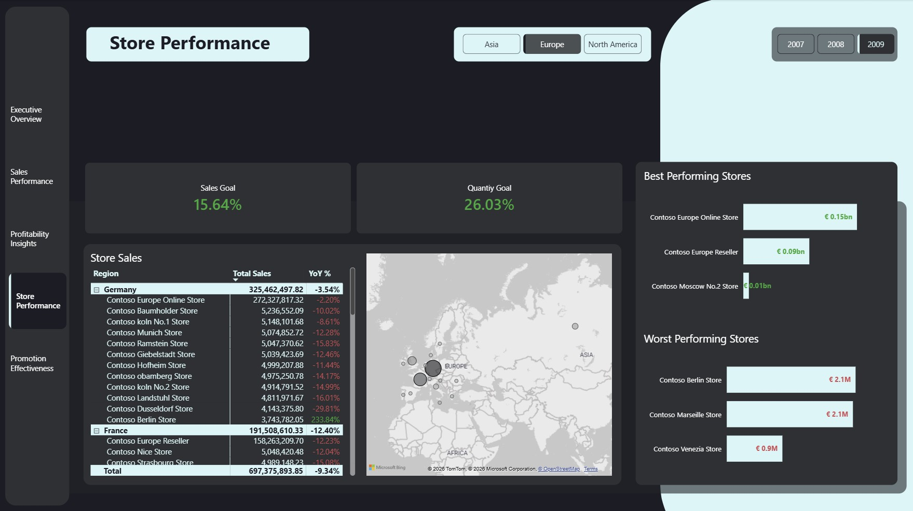

# 📊 Sales Analytics – Power BI Report

## 🔎 Overview

This Power BI project analyzes sales and profitability performance for a retail company using the Contoso Retail Data Warehouse.

The report is designed as an executive-level dashboard, focusing on revenue drivers, product performance, geographic insights, and promotion effectiveness.

---

## 🏗 Data Model

The report is built using a clean **star schema**:

- **Fact Table**
  - FactSales

- **Dimension Tables**
  - DimDate
  - DimProduct
  - DimCategory
  - DimProductSubCategory
  - DimStore
  - DimCustomer
  - DimChannel
  - DimPromotion
  - DimGeography

The model follows best practices:
- Single-direction relationships
- Hidden foreign keys
- Dedicated measures table
- Organized display folders
- Proper date table configuration

---

## 📈 Key Business Questions Answered

- How is total revenue and profitability trending over time?
- Which product categories drive the most revenue?
- What is each category’s contribution to total sales?
- Which products are top performers (dynamic Top-N)?
- How do regions and stores compare?
- Are promotions and channels effective?

---

## 🚀 Key Features

- Executive KPI overview
- Dynamic metric parameter (Sales ↔ Quantity)
- Year-over-Year analysis
- Category % contribution to total sales
- Dynamic Top-N product ranking
- Geographic performance analysis
- Promotion impact evaluation
- Clean star schema modeling
- Modern report design

---

## 🧠 DAX & Technical Highlights

- Time intelligence (YoY, YTD)
- Context-aware % contribution measures
- Parameter-driven metric switching
- Visual calculations for min/max highlighting
- Optimized reusable base measures

---

## 📊 Report Screenshots

### Executive Overview

### Sales Performance 

### Profitability Insights

### Store Performance

### Promotion Effectiveness

---

## 🛠 Tools Used

- Power BI Desktop
- DAX
- Contoso Retail Data Warehouse
- SQL Server

---

## 🎯 Objective

The purpose of this project is to demonstrate:

- Strong dimensional modeling
- Advanced DAX capabilities
- Business-oriented analytical thinking
- Clean and scalable Power BI design

---

## 📬 Contact

If you’d like to discuss this project or collaborate, feel free to connect.

